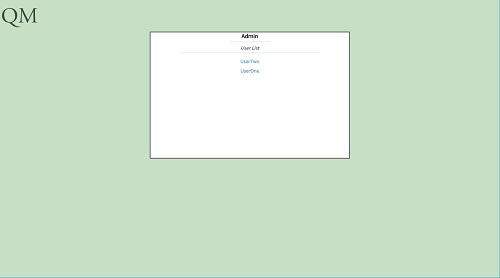
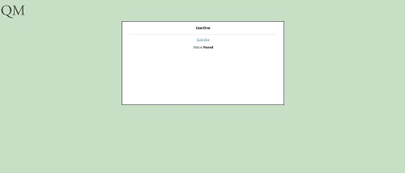
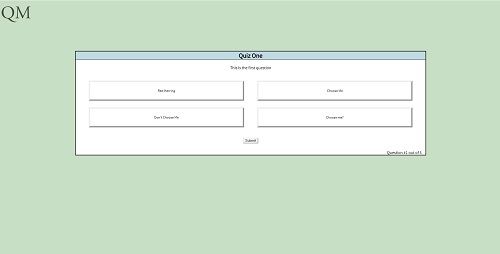

# MVP For Quiz Manager App

A working mvp for a quiz manager application. Find the demo at https://guiz-manager.herokuapp.com/

## Description
Our quiz manager application allows users to complete content that is required for their job, and for administrators to check on the users' progress.
It's an easy way for users to access content they need to complete and for the powers that be to check that the content is being completed.

Our MVP uses quizzes as content, but the content could easily be anything (forms, articles, etc.).

## How To Use
At the time of writing, there is no way to create users or quizzes, so there is some provided user/quiz data in the remote database for you to use.

### Admin: (will be removed when more features are added)
#### username: Admin, password: test-password
The admin can view a list of non-admin users and click on their names. This will bring up the user's status in regards to each quiz.

### UserOne: (will be removed when more features are added)
#### username: UserOne, password: test-password
This user can view a list of quizzes and their status in regards to the quiz (not taken, passed, failed). The user can then click on a quiz and take it.
At the end of the quiz the results will be shown and a passing or failing status will be applied.

### UserTwo: (will be removed when more features are added)
#### username: UserOne, password: test-password
This user can view a list of quizzes and their status in regards to the quiz (not taken, passed, failed). The user can then click on a quiz and take it.
At the end of the quiz the results will be shown and a passing or failing status will be applied.

## Screengrabs
Login screen:

Admin Page:

User Page:

Quiz Page:

## The Stack

* **The Front End**
  * React
  * Redux
  * CSS
* **The Back End**
  * Node
  * Express
  * Mongo instance on mLab
  * Mongoose

## Lessons Learned

* **Process, Planning, Development, Coordination**
  * For the purposes of an MVP go for the simpler solution that works, worry about higher functionality later.
* **Development and Technology**
  * Pros:
    * React is fun to work with.
    * Redux makes is really easy to think about and manage state.
  * Cons:
    * How does passport.session() work?
    * The fetch api does not automatically send cookies (more research needed).
* **Next Steps**
  * Persistent login system so users stay logged in after refresh (cookies!).
  * Better authentication so users can't take other user's quizzes.
  * Sign out button!
  * User creation.
  * More admin features such as quiz creation.
